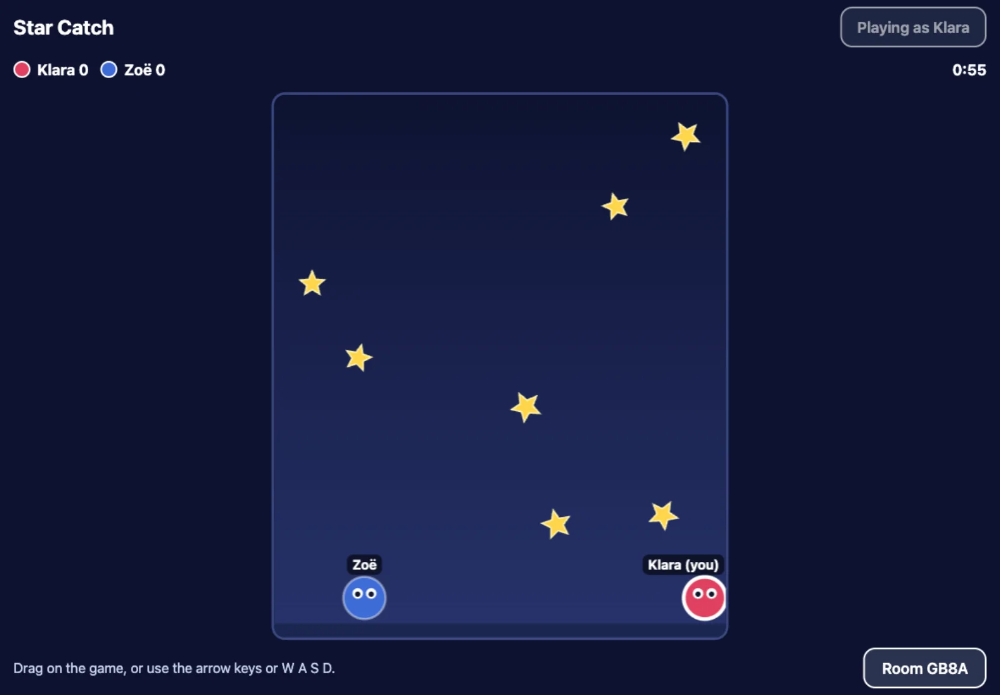

There are three parts: **the arcade**, where you play; **the game starter**, a
template a family copies to make a game; and **the kit** inside every game,
which connects it to the arcade and to other players.


## The arcade

[familyarcade.eu](https://familyarcade.eu) is a web app. Open it in a browser
on a phone, tablet or computer; on an iPad you can add it to the home screen
and it works like an app, offline too.

- **Players** are made on each device and saved in that device's browser:
  a name, tickets, wins and recent games. There are no accounts.
- **Games** are tiles on the home page. Some are for one player, some for a
  few players on one device, some for one player per device.
- **Play together** links phones and tablets with four letters, so a game can
  invite the others. Up to four devices.
- **From friends** is where games other families made appear, once you add
  them by link.

The arcade's own games are made by one family in one codebase. Everyone
else's games are made from the starter.

## Playing together, between homes

Two devices connect with a 4-letter code:

1. One device asks a free matchmaking service (PeerJS) to hold the code.
2. The other devices type the code and are introduced.
3. From then on the game travels **directly between the devices**, using the
   same technology as video calls (WebRTC).

The matchmaking service and two small public helpers (from Google and
Twilio) only help devices find each other. They never see names, moves,
video or voice. It works across homes and countries; a few strict networks
(some schools and offices) block it.

The device that made the code runs the game. The others send what their
player does and get back what happens.

## A family's own game



1. **Copy the starter.** On GitHub, the
   [game starter](https://github.com/family-arcade/arcade-game-starter) is a
   template. "Use this template" gives you your own copy, with a small sample
   game (Star Catch) to change.
2. **Build with an AI helper.** Claude Code reads the starter's rules and
   writes the code you describe. Each change waits for you to merge it.
3. **It goes on the web by itself.** Every merged change is tested, built and
   published to your own address, like
   `https://your-name.github.io/dragon-dash/`. GitHub hosts it, for free.
4. **Share the link.** Anyone you send it to can play it, alone or together
   with a code.
5. **Add it to the arcade.** In the arcade, "Add a game from a friend" and
   paste the link. It becomes a tile on that device.

Nothing in this needs our server. Your game lives in your GitHub account; the
arcade only remembers its link, on your device.

## The kit

Every game made from the starter has a small folder, `src/arcade/`, called
the kit. It is the only part of a game that knows about the arcade:

- **who is playing**: the arcade hands over the player's name and colour when
  it opens a game, or the game asks "Who's playing?";
- **saving**: scores and progress stay in the browser, per player and game;
- **playing together**: making and joining codes, up to four devices;
- **back to the arcade**: a button that returns to where you came from.

The details are in [The kit](/reference/kit/).

## Opening a friend's game from the arcade

When you tap a friend's game, the arcade opens its website with the player in
the link, after a `#`:

```
https://cousin.github.io/dragon-dash/#arcade=eyJ2IjoxLCJuYW1lIjoiS2xhcmEi…
```

The part after `#` never leaves the browser; websites do not receive it. The
game reads the name and colour, removes them from the address bar, and shows
"← Arcade" to go back.

## Where things are hosted

| What | Where |
|---|---|
| The arcade | familyarcade.eu, a server in Germany (Hetzner, Falkenstein) |
| This guide | learn.familyarcade.eu, the same server |
| A family's game | that family's GitHub Pages |
| The starter's code | GitHub |
| Players and saves | the browser on each device |

## What comes later

- **Accounts for parents**, so a family's players and saves follow them
  across devices.
- **Friends without codes**: link two families once, then invite each other.
- **A public gallery** of games, checked before anything is listed.
- **A benchmark**: a public ranking of how well AI models do at the parts of
  making a game: concept art, 3D models and game mechanics.
