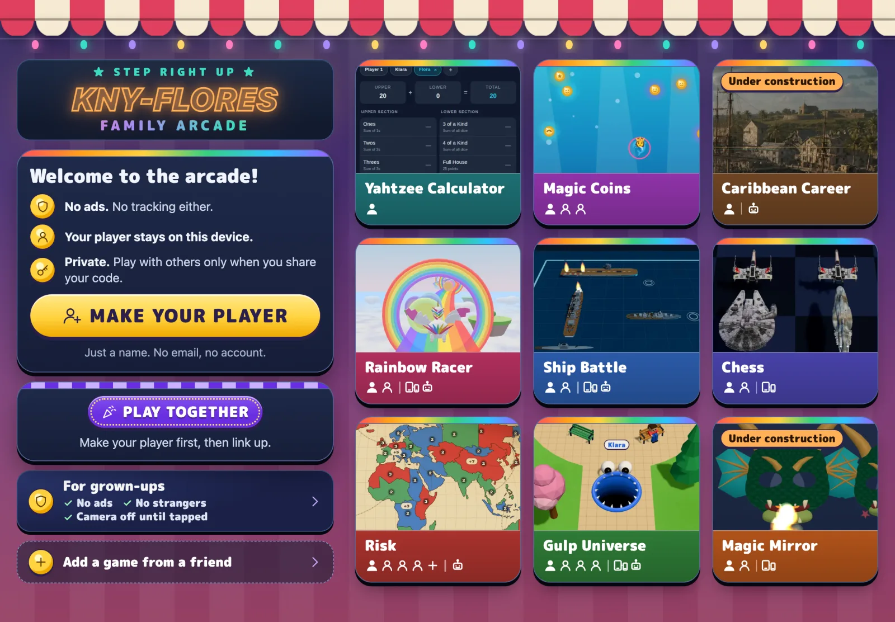

import ArcadeDiagram from '../../components/ArcadeDiagram.astro';
import GhIcon from '../../components/GhIcon.astro';
import Shot from '../../components/Shot.astro';
import gulpCode from '../../assets/screens/gulp-together-code.webp';

The Family Arcade is a set of browser games your family plays on its own devices, together or alone. Friends open a game in their own Family Arcade, with their own player. Then their devices connect with a four-letter code.

<ArcadeDiagram which="parts" />

## The arcade at familyarcade.eu



[familyarcade.eu](https://familyarcade.eu) is a web app. Open it in a browser on a phone, tablet or computer. On an iPad, add it to the home screen. Then it works like an app, even offline.

- **Players** are made on each device. The browser saves a name, tickets, wins and recent games. There are no accounts.
- **Games** are tiles on the home page. Some are for one player, some for a few players on one device, some for one player per device.
- **Play together** links devices with four letters. Up to four can connect.

One family made the arcade's games.

## Playing together across homes

Each player opens the game in their own Family Arcade. One device shows four letters. The others type them.

<Shot images={[{ src: gulpCode, alt: 'Gulp, ready to play together: one device shows the code KQZT, three players have joined, and a fourth place is waiting' }]}>
  Three friends about to play Gulp. One device shows the code. The other two typed it.
</Shot>

<ArcadeDiagram which="together" />

1. One device makes a code.
2. The other devices type the code. The Family Arcade's own connection service, on our server in Germany, passes the first hello between them. It keeps no log.
3. From then on, the game's data travels **directly between the devices**. It uses the same technology as video calls, called WebRTC.

It works across homes and countries. A few strict networks, such as some school and office networks, block it.

The device that made the code runs the game. The others send what their player does and get back what happens.

## Making and sharing a game

1. **Start from the template.** On GitHub, choose **Use this template** on the [starter template](https://github.com/family-arcade/arcade-game-starter) to make your own repository. It is an empty game with Play together already working.
2. **Build with an AI helper.** Claude Code reads the template's rules and asks your child a few questions. It makes each change on a branch, a copy for trying things. Merging adds the change to your game.
3. **It goes on the web by itself.** Once GitHub Pages is on, every merged change is tested, built and published to your own address, such as `https://your-name.github.io/dragon-dash/`. GitHub hosts it for free.
4. **Add it to the arcade.** Tap **Add a game from a friend** and paste the link. The game becomes a tile on that device.
5. **Play with friends.** Send them the link. They add the game to their own arcade, then you play together with a code.

Your game lives in your GitHub account, not on our server. The arcade only remembers its link on your device. Our server comes in only when you play together, to pass the first hello.

## Arcade kit in each game

Every game made from the starter template has a small folder, `src/arcade/`, called the kit. It is the only part of a game that knows about the arcade:

- **Who is playing.** The arcade hands over the player's name and colour. If it does not, the game asks "Who's playing?".
- **Saving.** Scores and progress stay in the browser, per player and game.
- **Playing together.** Making and joining codes, for up to four devices.
- **Back to the arcade.** A button that returns to where you came from.

The details are in [Arcade kit reference](/reference/kit/).

## Opening a friend's game

<ArcadeDiagram which="friend" />

When you tap a friend's game, the arcade opens its website. It puts the player's name and colour in the link after a `#`:

```
https://cousin.github.io/dragon-dash/#arcade=eyJ2IjoxLCJuYW1lIjoiS2xhcmEi…
```

The part after `#` never leaves the browser. Websites do not receive it. The game reads the name and colour, removes them from the address bar and shows "← Arcade".

## Hosting locations

| What | Where |
|---|---|
| The arcade | familyarcade.eu, a server in Germany (Hetzner, Falkenstein) |
| This guide | learn.familyarcade.eu, the same server |
| The connection service for playing together | the same server |
| A family's game | that family's GitHub Pages |
| The starter template's code | GitHub |
| Players and saves | the browser on each device |

## Features that may come

- **Accounts for parents**, so a family's players and saves follow them
  across devices.
- **Friends without codes**: link two families once, then invite each other.
- **A public gallery** of games, checked before anything is listed.
- **A benchmark**: a public ranking of how well AI models do at the parts of
  making a game: concept art, 3D models and game mechanics.
