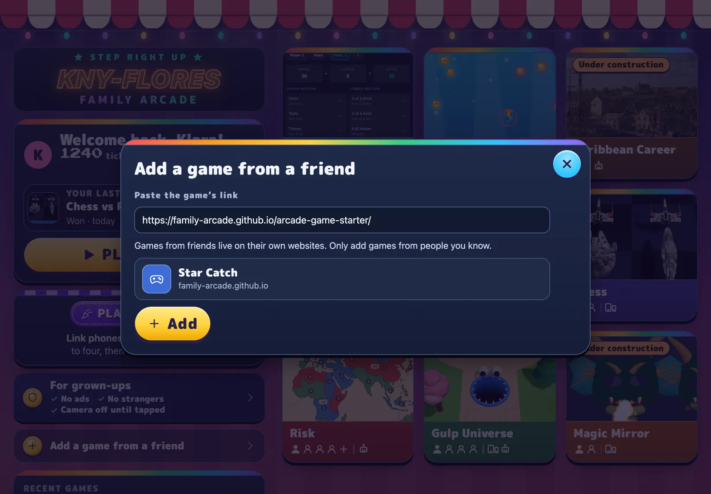
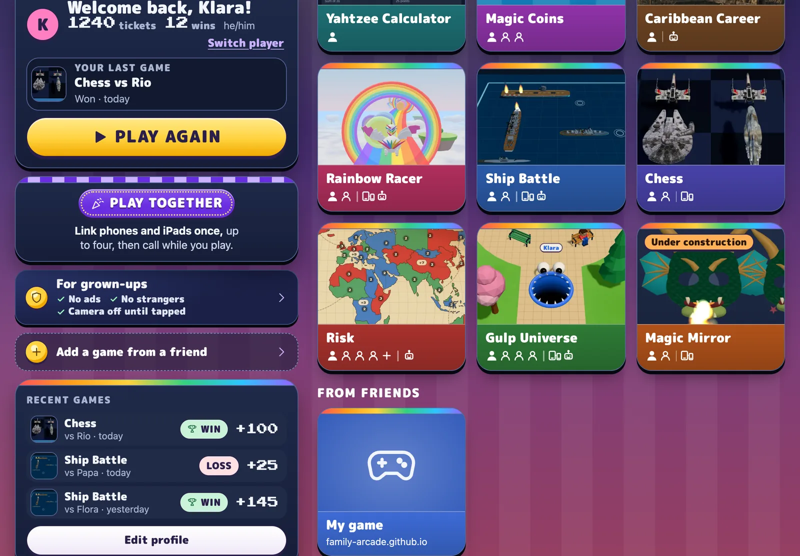

import Prompt from '../../../components/Prompt.astro';

The Family Arcade at [familyarcade.eu](https://familyarcade.eu) is where your
family plays. Add your game, and it becomes a tile there. Friends add it the
same way. That is how you play together.

1. Open [familyarcade.eu](https://familyarcade.eu) on the device.
2. Make your player if you have not done that yet.
3. Tap **Add a game from a friend**.
4. Add your game:
   1. Paste your game's link.
   2. Tap **Look it up**.
   3. Tap **Add**.

Your game is now a tile under **From friends**. Tap it to open your game with
your player's name and colour already filled in. Tap **← Arcade** to go back.

:::note
The list of games from friends is kept on each device. Add them on every
phone and tablet you play on.
:::

## Send your game to friends

Send your game's link to cousins and friends. Each of them adds it in their
own Family Arcade, with the same steps. Add their games the same way, with
the links they send you.

:::caution[Only add games from people you know]
A friend's game lives on their own website, and what it does is up to them.
:::

## Name and colour your game

The arcade reads your game's name and colour from a small file in your game,
`public/arcade.json`. Ask Claude to change it:

<Prompt>Rename the game to Dragon Dash, make its colour a deep purple, and update the description.</Prompt>

Next time someone adds your game, the tile shows the new name and colour.

Next: [Play your game with friends](/make/together/).
