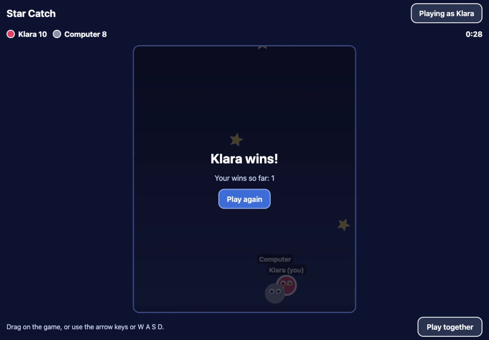

## Make your copy

1. Sign in to GitHub and open the
   **[game starter](https://github.com/family-arcade/arcade-game-starter)**.
2. Click the green **Use this template** button, then **Create a new
   repository**.
3. Give your game a name, in small letters with dashes instead of spaces:
   `dragon-dash`. You can change it later.
4. Choose **Public**, then click **Create repository**.

That is your game's home on GitHub. Everything about it lives here.

## Put it on the web

1. In your new repository, open **Settings** (the tab with the cog), then
   **Pages** in the list on the left.
2. Under **Build and deployment**, set **Source** to **GitHub Actions**.
3. Open the **Actions** tab, click **Deploy to GitHub Pages** on the left,
   then **Run workflow**, and **Run workflow** again.
4. Wait for the dot to turn green: a minute or two.

Your game is now at:

```
https://<your-github-name>.github.io/<game-name>/
```

Open it. That is **Star Catch**, the sample game: catch the falling stars,
first to 10 wins. Play a round against the computer.



:::tip
Bookmark your game's address. On a phone or tablet, add it to the home
screen.
:::

Next: [Meet your AI helper](/make/ai-helper/).
