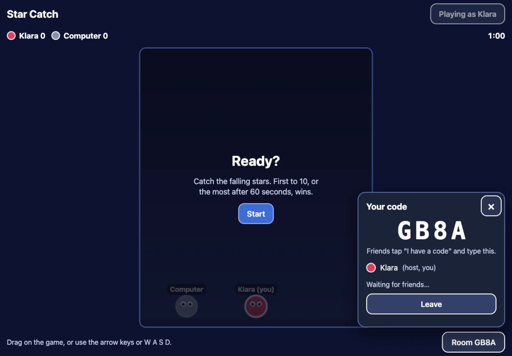

Send your game's link to family or friends. Everyone opens it on their own
phone, tablet or computer, then:

1. Everyone taps **Play together**.
2. One person taps **Make a code** and reads out the 4 letters.
3. Everyone else taps **I have a code**, types the letters and taps **Join**.
4. The person who made the code taps **Start**.

Up to four devices play together. Different homes and different countries
are fine. A few strict networks (some schools and offices) block it; home
wifi and mobile data work.

## On one computer, to test

Open the game in two browser windows, one of them private (so each window
has its own player), and use one as the host and the other as the guest.

## Making your own game work together

Tell Claude what playing together means in your game:

> In my game, each player is a dragon in their own colour. Everyone sees all
> the dragons, and the first to 20 gems wins. Keep it working for up to 4
> players.

The device that made the code runs the game; the others send what their
player does. Claude knows how to set this up from the starter's rules.

Next: [Put it in the arcade](/make/arcade/).
