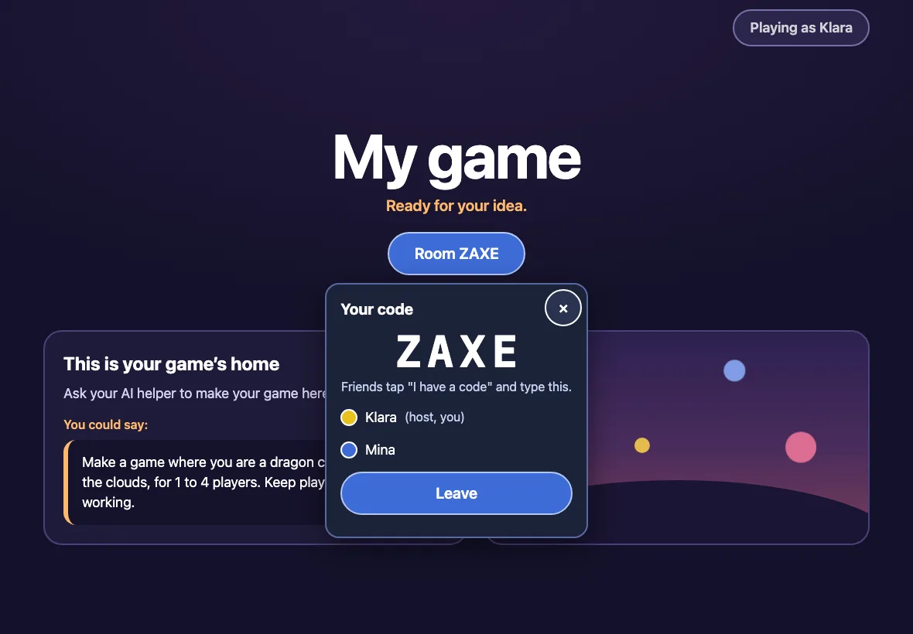

import ArcadeDiagram from '../../../components/ArcadeDiagram.astro';
import Prompt from '../../../components/Prompt.astro';

Friends play your game with you through the Family Arcade. Each friend opens
your game in their own Family Arcade, with their own player. Then the devices
connect with a 4-letter code.

## Playing together

1. Everyone opens your game in their Family Arcade. A friend who has not
   added it yet follows [Add your game to the arcade](/make/arcade/).
2. Everyone taps **Play together**.
3. One person taps **Make a code** and reads out the 4 letters.
4. Everyone else taps **I have a code**, types the letters and taps **Join**.
5. The person who made the code taps **Start**.

Up to four devices can play together. Different homes and different
countries are fine. A few strict networks, including some school and office
networks, block it. Home wifi and mobile data work.

## How the devices connect

<ArcadeDiagram which="together" />

Devices find each other through the Family Arcade's own connection service,
on our server in Germany. It passes only the first hello between the devices
and keeps no log. After that, the game's data goes directly between the
devices.

## Testing on one computer

1. Open the game in two browser windows.
2. Make one window private, so that each window has its own player.
3. Use one window as the host and the other as the guest.

## Play together in your game

Tell Claude what playing together means in your game:

<Prompt>In my game, each player is a dragon in their own colour. Everyone sees all the dragons, and the first to 20 gems wins.</Prompt>

The device that made the code runs the game. The other devices send what
their players do. Claude knows how to set this up from the template's rules.

Next: [Fix common problems](/make/stuck/).
